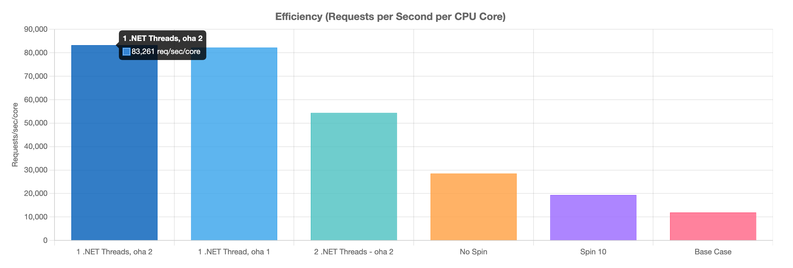

## Overview

This demo shows the problem with async task completions moving between threads and how much CPU that is using.

> 🔥 **Key Finding**: By limiting worker threads to 1 and disabling semaphore spinning, we achieved **7x more requests per CPU core** compared to the default .NET configuration.

This problem exists in all async frameworks I tested, including those in the JVM, Go, Rust, and Dotnet.  Limiting each framework to 1 or 2 threads can significantly reduce CPU usage and increase RPS per CPU core.  For a simple way to test these other frameworks, just use the web server examples in [the-benchmarker/web-frameworks](https://github.com/the-benchmarker/web-frameworks) and experiment with the number of threads allowed for async tasks.

Node.js does not suffer from this because it has a single worker thread in each Javascript runtime instance, so there is no context switching between threads and no task stealing.

The question is: why are we using async task completions at all if it's causing `7x` more CPU usage per RPS compared to a single thread?

## Performance Visualization



*The above chart shows requests/second/CPU core for different thread pool configurations. Higher is better.*

You can generate these charts with real benchmarks on your system by running:

```bash
# Install prerequisites (if needed)
# npm install -g node@20
# cargo install oha

# Get help and see all available options
./run.sh --help

# Run benchmarks and generate visualizations
./run.sh

# Or test with sample data without running benchmarks (much faster)
./run.sh --test

# Clean up any lingering processes if needed
./run.sh --clean
```

After running the benchmarks:
1. View the interactive charts in your browser
2. Take screenshots of the charts and save them to the `screenshots` directory
3. The full results are available in `docs/index.html` and `benchmark-data.json`

### Key Findings Visualized

The charts clearly show:

1. **CPU Efficiency**: Single worker thread configuration delivers 7x more requests per CPU core
2. **Thread Overhead**: Default ThreadPool settings waste significant CPU on context switching
3. **Semaphore Spinning**: Disabling ThreadPool semaphore spinning alone cuts CPU usage by 50%

See [charts](docs/index.html) for detailed interactive results after running benchmarks.

## Links

Initial report of high CPU usage in a reverse proxy: https://github.com/pwrdrvr/lambda-dispatch/issues/43

Open issue in DotNet since 2022, with partial work-around: https://github.com/dotnet/runtime/issues/72153#issuecomment-1216363757

Original source for aspnet-minimal-api: [aspnet-minimal-api](https://github.com/the-benchmarker/web-frameworks/tree/master/csharp/aspnet-minimal-api)

Original source for thread pool control function: [Program.cs](https://github.com/pwrdrvr/lambda-dispatch/blob/e5e32a0d5bdbbfb6e89acaedaf4bf2ec7d0de177/src/PwrDrvr.LambdaDispatch.Router/Program.cs#L8-L74s)

Details of 700% CPU usage for a dotnet reverse proxy to send 17k RPS to a Node.js express server using less than 100% CPU: https://github.com/pwrdrvr/lambda-dispatch/issues/109

### .NET Runtime Source Code References

The specific cause of the issue can be traced to these parts of the .NET Runtime source code:

- **PortableThreadPool.WorkerThread** - Location where Unfair semaphore spin limit can override the default: [View source](https://github.com/dotnet/runtime/blob/599996a65fd7c4e239215bcea460bf8a23303dae/src/libraries/System.Private.CoreLib/src/System/Threading/PortableThreadPool.WorkerThread.cs#L53C21-L58)

- **PortableThreadPool.WorkerThread** - Location where SemaphoreSpinCountDefaultBaseline is set to 70, but set to 4 * 70 = 280 on ARM platforms: [View source](https://github.com/dotnet/runtime/blob/599996a65fd7c4e239215bcea460bf8a23303dae/src/libraries/System.Private.CoreLib/src/System/Threading/PortableThreadPool.WorkerThread.cs#L18-L27)

- **LowLevelLifoSempahore** - Location where spinCount appears to be doubled again on Unix platforms (potentially boosting this to 560 on Mac ARM?): [View source](https://github.com/dotnet/runtime/blob/599996a65fd7c4e239215bcea460bf8a23303dae/src/libraries/System.Private.CoreLib/src/System/Threading/LowLevelLifoSemaphore.cs#L97-L100)

## Running Locally

### Install DotNet 8.0 SDK

[.NET 8.0 SDK](https://dotnet.microsoft.com/en-us/download/dotnet/8.0)

### Build

```bash
dotnet restore
dotnet build -c Release
```

### Automated Test Script

Note: `nvm` is a tool to get version 20 of Node.js - you can use any other method to get v20, or any other compatible version.

#### Mac / Linux

```bash
nvm use

./run.sh
```

#### Windows

```bash
nvm use

node run-benchmarks.js
node generate-charts.js
```

### Manually Testing

<details>
<summary>Click to expand</summary>
#### Run

```bash
# Base case - Uses 600-670% CPU to deliver 130k-140k RPS
# ~22k RPS per CPU core
# This *as fast* as Node.js with express.js per CPU core
dotnet run -c Release --project src/web/web.csproj

# Disabling Semaphore spinning - Uses 266-320% CPU to deliver 115k-130k RPS
# ~43k RPS per CPU core
DOTNET_ThreadPool_UnfairSemaphoreSpinLimit=0 dotnet run -c Release --project src/web/web.csproj

# Note on `oha` CPU usage
# `oha` (Rust) is using 200-300% CPU to geneate the above requests with default Tokio async runtime config

# Limiting `oha` to 1 thread - Uses 700% CPU to deliver 100k RPS
# 14k RPS per CPU core
dotnet run -c Release --project src/web/web.csproj

# Limiting `oha` to 1 thread and disabling Semaphore spinning - Uses 300% CPU to deliver 90k RPS
# 30k RPS per CPU core
# `oha` uses 90% CPU
DOTNET_ThreadPool_UnfairSemaphoreSpinLimit=0 dotnet run -c Release --project src/web/web.csproj

# Limiting `oha` to 2 threads and disabling Semaphore spinning - Uses 330% CPU to deliver 120k-140k RPS
# 43k RPS per CPU core
# `oha` uses 160% CPU
DOTNET_ThreadPool_UnfairSemaphoreSpinLimit=0 dotnet run -c Release --project src/web/web.csproj

# Limiting dotnet to 1 thread, disabling Semaphore spinning, and limiting `oha` to 2 threads
# Uses 114% CPU to deliver 120k-130k RPS
# 105k RPS per CPU core
# 🔥 4.8x RPS per CPU core compared to base case 🔥
# `oha` uses 125% CPU
# Note: 1 thread can get a little wonky with the async completions
 LAMBDA_DISPATCH_MaxWorkerThreads=1 DOTNET_ThreadPool_UnfairSemaphoreSpinLimit=0 dotnet run -c Release --project src/web/web.csproj

 # Limitng the IO completion port threads to 1 has no effect on CPU usage
```

#### Testing

```bash
# Smoke Test
curl http://localhost:5001/user/1234

# Load Test
# In this case oha will use too many threads and will be slower with 2x to 3x more CPU usage than necessary
# Incidentally, this is the same problem that dotnet is having with async task completions / spin waits / work stealing
oha -c 20 -z 60s http://localhost:5001/user/1234

# Load test with 1 Tokio runtime thread - 20 concurrent sockets
TOKIO_WORKER_THREADS=1 oha -c 20 -z 60s http://localhost:5001/user/1234

# Load test with 1 Tokio runtime thread - 100 concurrent sockets
TOKIO_WORKER_THREADS=1 oha -c 100 -z 60s http://localhost:5001/user/1234
```
</details>
